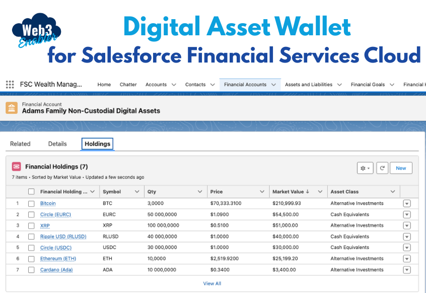

# Digital Asset Wallet for Salesforce Financial Services Cloud



Web3 Enabler Digital Asset Wallet for [Salesforce 
Financial Services Cloud](https://www.salesforce.com/financial-services/cloud) provides financial advisors with user-friendly access to blockchain data, such as Ethereum or Bitcoin transactions, to allow clients to share a full picture of their total assets with their financial advisors.  You can check our [user guide](https://github.com/MuKnSys/digital-asset-wallet-for-salesforce-financial-services-cloud/blob/main/documentation-and-images/Web3%20Enabler%20Digital%20Asset%20Wallet%20for%20Salesforce%20v0.1%20User%20Guide.pdf) for more information about how to use the app.

## Installation & Setup

The following installation and setup steps are also shown in this [video demonstration](https://youtu.be/khIhLIKqMVM).

1. **Clone the repository to your local machine:**
   ```sh
   git clone https://github.com/MuKnSysEnterprise/digital-asset-wallet-for-salesforce-financial-services-cloud.git
   cd digital-asset-wallet-for-salesforce-financial-services-cloud
   ```

2. **Checkout the Main Branch:**
   ```sh
   git checkout main
   ```

3. **Log into your Dev Hub Org:**
   ```sh
   sf org login web --set-default-dev-hub --alias DevHub --instance-url https://login.salesforce.com
   ```
   Enter your username and password. You can learn more about setting up a DevHub org by reading the [official documentation](https://developer.salesforce.com/docs/atlas.en-us.sfdx_dev.meta/sfdx_dev/sfdx_setup_enable_devhub.htm).

4. **Create a Scratch Org:**
   ```sh
   sf org create scratch -f ./config/project-scratch-def.json -a dev -d -y 30
   ```
   - The `-f` flag is a path to config file (no need to change it).
   - The `-a` flag is an alias of the scratch org, if you create multiple scratch orgs you can give them unique aliases to easier refer to them.
   - The `-d` flag marks the newly created scratch org as default. If you don't mark it as default you will have to reference it by username or alias, or you will have to use `sf config set target-org YourAliasOrUsername` to set it as default.
   - The `-y` flag sets the number of days before the org expires.
   - Use the `-h` flag for help.
   - For more details: [Create Scratch Orgs (Salesforce Docs)](https://developer.salesforce.com/docs/atlas.en-us.sfdx_dev.meta/sfdx_dev/sfdx_dev_scratch_orgs_create.htm)

5. **Install Financial Services Cloud (FSC) packages**
   Run the following commands in sequence (wait for each to finish):
   ```sh
   sfdx force:package:install --package 04t1E000000jb9R -w 20
   sfdx force:package:install --package 04t1E000001Iql5 -w 20
   sfdx force:package:install --package 04t3i000000jP1g -w 20
   ```
   Each command installs a required FSC package with a 20-minute wait time.

6. **Open the org:**
   ```sh
   sf org open
   ```

7. **Assign Financial Services Cloud Permission Set:**
   - In Salesforce Setup, go to **Permission Sets**.
   - Assign the following permission set to your user:
     - Financial Services Cloud Basic

8. **Push code to the scratch org:**
   ```sh
   sf project deploy start
   ```

9. **Assign the Digital Asset Wallet Admin permission set:**
   ```sh
   sf org assign permset --name Digital_Asset_Wallet_Admin
   ```

10. **Open the org:**
    ```sh
    sf org open
    ```

## Financial Services Cloud (FSC) Installation Guide

### Prerequisites
- A Salesforce org with Financial Services Cloud enabled
- Admin access to the org
- Required FSC package IDs:
  - Core FSC: `04t1E000000jb9R`
  - FSC Standard: `04t1E000001Iql5`
  - FSC Advanced: `04t3i000000jP1g`

### Installation Steps
1. **Verify FSC Access**
   - Ensure your org has FSC enabled
   - Check that you have the necessary licenses

2. **Install FSC Packages**
   - Install packages in the following order:
     1. Core FSC Package
     2. FSC Standard Package
     3. FSC Advanced Package
   - Use the following commands (run each one and wait for it to finish before running the next):
     ```bash
     sfdx force:package:install --package 04t1E000000jb9R -w 20
     sfdx force:package:install --package 04t1E000001Iql5 -w 20
     sfdx force:package:install --package 04t3i000000jP1g -w 20
     ```
   - Each installation may take up to 20 minutes
   - Wait for each package to complete before installing the next

3. **Post-Installation Configuration**
   - Assign FSC permission sets to users:
     - Financial Services Cloud Basic
   - Configure FSC settings in Setup
   - Set up required FSC objects and fields

4. **Verify Installation**
   - Check that FSC objects are available
   - Verify FSC features are working
   - Test FSC functionality with sample data

### Troubleshooting
- If package installation fails:
  - Check org limits and storage
  - Verify user permissions
  - Review installation logs
- If FSC features are not available:
  - Confirm package installation status
  - Check user permissions
  - Verify FSC settings

## Post-Install Manual Steps

After deploying the project, complete the following manual steps in your Salesforce org:

- **1. Assign Digital Asset Wallet Admin Permissions**
    - In Salesforce Setup, go to **Permission Sets**.
    - Find and assign the `Digital_Asset_Wallet_Admin` permission set to your user.

- **2. Set Up Web3 Integration with the Connected App**
    - In Salesforce Setup, go to **App Manager**.
    - Locate the Web3 Connected App (or create one if needed).
    - Configure OAuth settings and callback URLs as required for your integration.
    - Assign the Connected App to the appropriate profiles or permission sets for your users.

- **3. Assign All Required FSC Permissions**
    - In Salesforce Setup, go to **Permission Sets**.
    - Assign the following standard FSC permission set to your user:
        - `Financial_Services_Cloud_Basic`
    - This is a standard permission set provided by the FSC managed package and must be assigned via the Salesforce UI.

## Additional resources

-   [Enable Dev Hub in Your Org (Salesforce Docs)](https://developer.salesforce.com/docs/atlas.en-us.sfdx_dev.meta/sfdx_dev/sfdx_setup_enable_devhub.htm)
-   [Create Scratch Orgs (Salesforce Docs)](https://developer.salesforce.com/docs/atlas.en-us.sfdx_dev.meta/sfdx_dev/sfdx_dev_scratch_orgs_create.htm)
-   [Salesforce Extensions Documentation](https://developer.salesforce.com/tools/vscode/)
-   [Salesforce CLI Setup Guide](https://developer.salesforce.com/docs/atlas.en-us.sfdx_setup.meta/sfdx_setup/sfdx_setup_intro.htm)
-   [Salesforce DX Developer Guide](https://developer.salesforce.com/docs/atlas.en-us.sfdx_dev.meta/sfdx_dev/sfdx_dev_intro.htm)
-   [Salesforce CLI Command Reference](https://developer.salesforce.com/docs/atlas.en-us.sfdx_cli_reference.meta/sfdx_cli_reference/cli_reference.htm)
-   [Salesforce DX Project Configuration](https://developer.salesforce.com/docs/atlas.en-us.sfdx_dev.meta/sfdx_dev/sfdx_dev_ws_config.htm)


## Copyright and License

Copyright 2024 Web3 Enabler, Inc. Digital Asset Wallet for Salesforce Financial Services Cloud is distributed under the GPL license, version 3.0. For more information, see the [LICENSE file](LICENSE).
